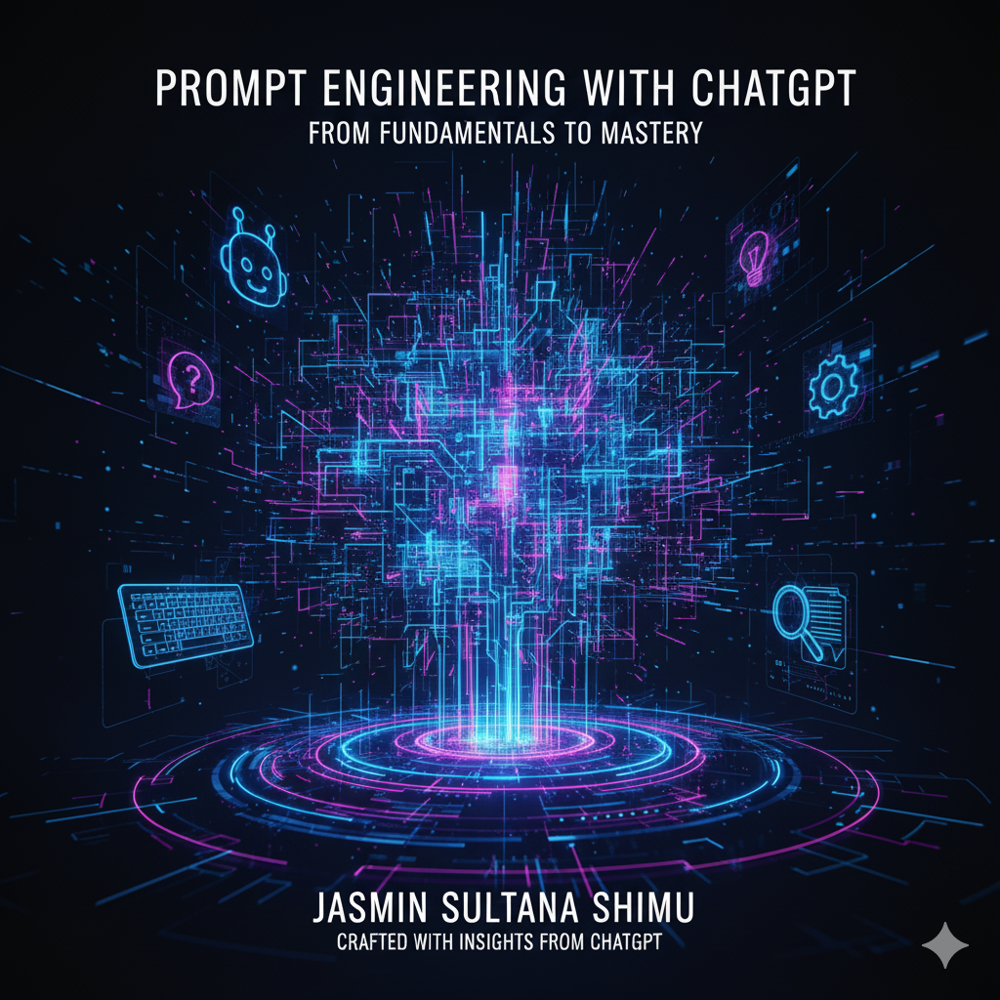

# Prompt Engineering with ChatGPT: From Fundamentals to Mastery

*By Jasmin Sultana Shimu, crafted with insights from ChatGPT*

---

## About this Repository
This repository contains a comprehensive, hands-on curriculum for learning prompt engineering with ChatGPT. 
It is designed for developers, students, and AI enthusiasts looking to master LLM prompting techniques and build practical AI applications.  
The content is structured to be practical, engaging, and applicable across multiple industries.

---

## 🎓 1. Course Overview

### 1.1 About the Course

**Prompt Engineering with ChatGPT** is a comprehensive guide and training program designed to take learners from foundational AI understanding to advanced prompt design and applied large language model (LLM) mastery.

This course integrates the best of:

1. Vanderbilt University’s *Prompt Engineering Specialization (Coursera)*
2. DeepLearning.AI’s *Prompt Engineering for Developers*
3. LearnPrompting.org (open-source content)
4. Udemy’s *Prompt Engineering: Getting Future Ready*
5. FreeCodeCamp’s *Master ChatGPT and LLM Responses*

The course is structured to be engaging, practical, and conversational — teaching by doing — so learners not only understand the theory but can confidently use, evaluate, and design prompts for real-world AI applications.

---

### 1.2 Who This Book Is For

| Audience | Description |
| --- | --- |
| 1. **CSE Students** | Learn prompt engineering as a parallel programming skill. Apply it to projects, AI integration, and automation. |
| 2. **Web Developers** | Use LLMs to generate, test, and document code for AI-powered applications. |
| 3. **Non-Coders & Professionals** | Learn to use AI tools effectively for writing, productivity, and analysis. |
| 4. **AI Enthusiasts** | Gain a broad understanding of LLM reasoning, prompting, and interaction design. |

---

### 1.3 Learning Goals

By the end of this course, you will:

1. Understand what prompt engineering is and its importance.
2. Master prompt structures, syntax, and reasoning with ChatGPT and other LLMs.
3. Learn expert prompting patterns (persona, chain-of-thought, ReAct, few-shot, etc.).
4. Build prompt-based applications and AI workflows.
5. Apply prompting across development, writing, education, and automation.
6. Prepare for prompt engineering certifications and interviews.

---

### 1.4 Skills You Will Gain

1. Prompt Engineering Fundamentals
2. LLM Reasoning and Optimization
3. API-Based Prompting (OpenAI, Anthropic, Gemini)
4. AI-Assisted Coding and Debugging
5. Chain-of-Thought and ReAct Prompt Design
6. Multi-Modal Prompting (text, image, audio)
7. Ethical and Trustworthy AI Design
8. Applied Prompting in Web Development
9. Productivity Prompting for Non-Coders

---

### 1.5 Estimated Duration

| Level | Duration | Description |
| --- | --- | --- |
| 1. **Beginner Track (Modules 1–3)** | 2–3 weeks | Core understanding and introduction to LLMs |
| 2. **Intermediate Track (Modules 4–6)** | 3–4 weeks | Prompt design patterns, reasoning, and few-shot techniques |
| 3. **Advanced Track (Modules 7–10)** | 4–6 weeks | Application building, automation, ethics |
| 4. **Final Practice & Certification Prep** | 1–2 weeks | Review, assessments, and portfolio building |

**Total Duration:** 10–14 weeks (Self-paced)

---

## 📘 2. Table of Contents

### **Track A: Foundations of Prompt Engineering (Beginner Level)**

### **Module 1: Introduction to Generative AI and ChatGPT**

1. What is Generative AI
2. How Large Language Models Work
3. The Role of Prompt Engineering
4. Setting Up ChatGPT and the OpenAI API
5. The AI Interaction Loop
6. Practice: Your First Prompt
7. **Exam Section:** MCQ + Short Answers + 1 Mini Project

---

### **Module 2: Understanding Prompts and Responses**

1. Definition and Purpose of a Prompt
2. Prompt Anatomy: Instruction, Context, and Output Format
3. Controlling Length, Tone, and Style
4. Understanding Temperature and Randomness
5. Troubleshooting Poor Responses
6. **Practice:** Rewrite a Prompt to Improve Clarity
7. **Exam Section:** Quiz + Role-Based Prompt Task

---

### **Module 3: Prompt Engineering Mindset**

1. Thinking Like an AI: Step-by-Step Reasoning
2. Task Decomposition and Logic Building
3. Evaluation and Iteration of Prompts
4. Common Pitfalls and How to Fix Them
5. **Practice:** Multi-Step Content Generation
6. **Exam Section:** Written Questions + Mini Interview

---

### **Track B: Intermediate Prompting for Developers & Professionals**

### **Module 4: Prompt Patterns I – Structured Prompt Design**

1. Introduction to Prompt Patterns
2. Persona Pattern
3. Question Refinement Pattern
4. Cognitive Verifier Pattern
5. Audience Persona Pattern
6. **Practice:** Build an Expert Persona Prompt
7. **Exam Section:** Pattern Matching + Practical Task

---

### **Module 5: Few-Shot and Reasoning Techniques**

1. Zero-Shot vs Few-Shot Prompting
2. Chain-of-Thought (CoT) Prompts
3. ReAct Pattern (Reason + Act)
4. Using Examples to Train Better Responses
5. Prompt Evaluation Metrics
6. **Practice:** Few-Shot Prompt for Data Analysis
7. **Exam Section:** Application + Code Challenge

---

### **Module 6: Intermediate Prompt Patterns II**

1. Game Play Pattern
2. Template Pattern
3. Meta Language Pattern
4. Recipe Pattern
5. Alternative Approaches Pattern
6. **Practice:** Design a Creative AI Task
7. **Exam Section:** Pattern Application + Case Study

---

### **Track C: Advanced Prompt Engineering and Applications**

### **Module 7: Building Prompt-Based Applications**

1. Combining Multiple Prompt Patterns
2. Ask-for-Input and Outline Expansion Patterns
3. Using LLMs for Automation
4. Semantic Filters and Fact-Checking
5. Role Collaboration and Tail Generation
6. **Practice:** Prompt Workflow for a Web App
7. **Exam Section:** Project + Interview Questions

---

### **Module 8: ChatGPT Advanced Data Analysis (ADA) Applications**

1. Introduction to ADA (Code Interpreter)
2. Working with Files and Data
3. Data Visualization and Automation
4. Building Reports and Presentations
5. **Practice:** Data-to-Presentation Automation
6. **Exam Section:** Applied Prompt + Reflection

---

### **Module 9: Trustworthy and Ethical Prompt Engineering**

1. Understanding Hallucinations in LLMs
2. Ethical Prompt Design
3. Transparency and Bias Mitigation
4. The ACHIEVE Framework
5. Responsible AI Usage
6. **Practice:** Prompt Audit for Bias
7. **Exam Section:** Case Study + MCQs

---

### **Module 10: Professional Development and Interview Preparation**

1. The Role of Prompt Engineers in Industry
2. Key Tools (OpenAI, Anthropic, Gemini, etc.)
3. Building a Prompt Portfolio on GitHub
4. Real Interview Question Sets
5. Resume and LinkedIn Optimization for AI Careers
6. **Practice:** Build a Prompt Portfolio Project
7. **Exam Section:** Final Exam + Interview Simulation

---

### **Bonus Section: Prompt Engineering for Non-Coders**

1. Everyday Prompting for Work and Study
2. Research and Summarization Prompts
3. Creative Prompts for Writing and Design
4. Tools: ChatGPT, Gemini, Midjourney, Leonardo, RunwayML
5. Case Studies: Marketing and Productivity
6. **Practice:** Design a Daily Task Automation Prompt

---

### **Appendices**

1. Prompt Engineering Glossary
2. Prompt Templates Library
3. AI Safety and Limitations
4. Troubleshooting Guide
5. Recommended Reading and Resources
6. Reference Section

---

## 📈 3. Learning Outcomes

1. Understand and apply prompt engineering principles.
2. Design and optimize prompts for multiple LLMs.
3. Build prompt-driven apps and workflows.
4. Prepare for prompt engineering roles and certifications.
5. Apply AI responsibly across industries.

---

## 💼 4. Where to Apply These Skills

1. **Software Development:** Code generation and debugging.
2. **Data Science:** LLM-based data analysis and visualization.
3. **Education:** AI tutoring, assessments, and content generation.
4. **Marketing:** AI-assisted campaigns and storytelling.
5. **Business Operations:** Report automation and communication.
6. **Creative Industries:** Scriptwriting, design, and ideation.

---

## 🧩 5. Tools Covered

1. OpenAI ChatGPT (GPT-4, GPT-4o)
2. Claude 3.5 (Anthropic)
3. Gemini Advanced
4. Midjourney / Leonardo AI / Stable Diffusion
5. RunwayML (GEN-2)
6. ElevenLabs (Audio)
7. Perplexity AI
8. GitHub Copilot

---

## 📚 6. References

1. [Coursera: Prompt Engineering for ChatGPT – Vanderbilt University](https://www.coursera.org/learn/prompt-engineering)
2. DeepLearning.AI: ChatGPT Prompt Engineering for Developers
3. Udemy: Prompt Engineering – Getting Future Ready
4. [LearnPrompting.org – Free Prompt Engineering Curriculum](https://learnprompting.org/)
5. FreeCodeCamp: Prompt Engineering Tutorial

---

## 🏁 7. Completion & Next Steps

1. Complete all modules and exercises to master prompt engineering skills.
2. Showcase your projects and practice prompts on GitHub.
3. Use this course as a foundation for building AI-based products or further learning.

---

## ⚖️ 8. License

This repository is licensed under the [CC BY-NC 4.0](LICENSE) license.  
You are free to share and adapt this content for **non-commercial purposes**, with proper attribution.

