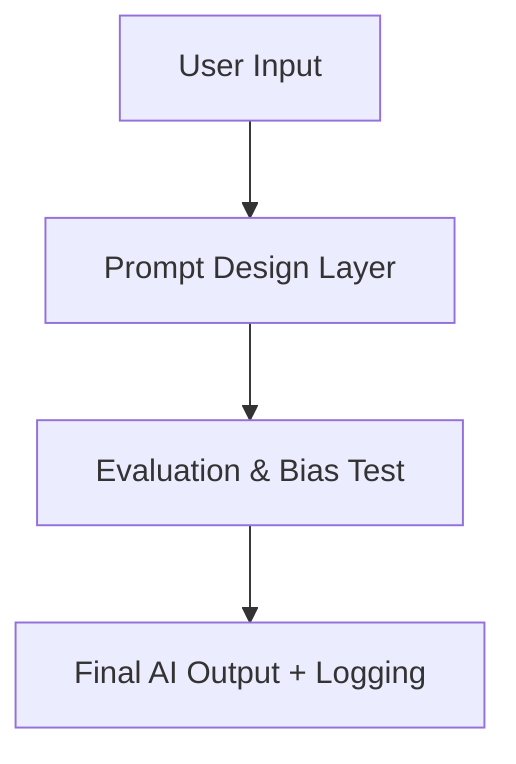

# 4.8

# 🧩 **1.4.4.8 Documentation & Publishing (GitHub Pages / MkDocs)**

---

## **Part A – Concept Foundations**

---

### **1️⃣ Why Documentation Matters**

In prompt engineering, great prompts lose value if they aren’t **understood, audited, or reproduced**.

Professional documentation turns your creative logic into **an accessible framework** that others can learn from or extend.

> 🧠 Analogy:
> 
> 
> Think of documentation as your **AI’s user manual** — without it, even the best-built machine gathers dust.
> 

✅ **Definition:**

> AI Documentation: A structured collection of descriptions, examples, and evaluation records explaining how an AI system or prompt workflow functions — written for both humans and machines.
> 

---

### **2️⃣ Core Principles of Effective Documentation**

| **Principle** | **Purpose** | **Example Application** |
| --- | --- | --- |
| **Clarity** | Make information accessible to any reader. | Use plain language; explain acronyms. |
| **Structure** | Organize content logically. | Intro → Setup → Usage → Evaluation → Ethics. |
| **Transparency** | Disclose data sources and limitations. | Add “Bias & Safety Notes” section. |
| **Reproducibility** | Enable others to replicate results. | Provide prompt version + model info. |
| **Visual Support** | Aid comprehension. | Include flowcharts, JSON examples, tables. |

✅ Professional prompt engineers treat documentation as **a living product**, not an afterthought.

---

### **3️⃣ Why Use GitHub Pages and MkDocs**

| **Tool** | **Purpose** | **Key Benefit** |
| --- | --- | --- |
| **GitHub Pages** | Hosts static websites directly from repos. | Free hosting + version control. |
| **MkDocs** | Converts Markdown files into websites. | Simple, elegant documentation framework. |
| **Material for MkDocs** | Modern theme extension. | Search, nav bar, dark mode support. |

✅ Both tools make your documentation **public, searchable, and maintainable**.

---

### **4️⃣ The Recommended Documentation Structure**

```
📂 docs/
 ├── index.md                → Overview / Home
 ├── getting-started.md      → Setup instructions
 ├── project-overview.md     → Prompt logic and goals
 ├── evaluation-metrics.md   → Scoring frameworks
 ├── ethics-governance.md    → ACHIEVE / Red-team summary
 ├── api-reference.md        → Parameters, examples
 └── changelog.md            → Version updates

```

✅ Keep docs modular — each page should explain one concept clearly.

---

### **5️⃣ Documentation Workflow**

| **Step** | **Action** | **Example Outcome** |
| --- | --- | --- |
| 1️⃣ Write in Markdown (.md)** | Easy to version & read. | “prompt-logic.md” with code fences. |
| 2️⃣ Configure `mkdocs.yml` | Define nav and theme. | Set site name and repo link. |
| 3️⃣ Preview locally | `mkdocs serve` | Instant browser preview. |
| 4️⃣ Deploy to GitHub Pages | `mkdocs gh-deploy` | Docs go live in seconds. |
| 5️⃣ Maintain | Update with each prompt version. | Ensure transparency and audit trail. |

✅ Automate deployment via GitHub Actions for professional CI/CD publishing.

---

## **Part B – Application and Examples**

---

### **Example 1 – MkDocs Configuration**

```yaml
site_name: Prompt Engineering Portfolio
theme:
  name: material
  features:
    - navigation.tabs
    - search.suggest
nav:
  - Home: index.md
  - Projects:
      - RAG Analyzer: projects/rag.md
      - ADA Dashboard: projects/ada.md
  - Ethics & Governance: ethics-governance.md
  - Evaluation: evaluation-metrics.md
repo_url: https://github.com/username/prompt-portfolio

```

✅ *Outcome:* Automatic, elegant documentation site synced with GitHub.

---

### **Example 2 – README Excerpts**

```markdown
# Prompt Auditor Dashboard
**Goal:** Automate bias and accuracy testing for prompt projects.
**Tech:** OpenAI API, LangChain, MkDocs Material.
**Results:** 97 % accuracy on factual evaluation prompts.
**Ethics:** Complies with ACHIEVE framework – no personal data used.

```

✅ Keep README concise but informative for new visitors.

---

### **Example 3 – Diagram Integration**

Add diagrams for prompt flows using Mermaid:



✅ Visuals help non-technical audiences understand system architecture.

---

### **Example 4 – Publishing Output**

After running `mkdocs gh-deploy`, your documentation becomes live at:

> https://username.github.io/prompt-portfolio/
> 

You can add:

- Analytics for visitor tracking
- Custom domain (e.g., `docs.careeriq.ai`)
- Search index for keywords (“RAG”, “bias”, “evaluation”)

✅ Now your portfolio is *not just readable — it’s professional and publicly searchable.*

---

## **Part C – Reflection, Quiz & Mini Project**

---

### **Reflection Prompt**

> Does your current project documentation pass the “5C Test”?
> 
> 
> **Clear, Complete, Consistent, Compliant, Credible.**
> 
> If not — which “C” will you improve first, and how?
> 

---

### **Quick Quiz**

| **Q#** | **Question** | **Type** |
| --- | --- | --- |
| 1 | What two tools are used to publish prompt documentation online? | Short Answer |
| 2 | Name two benefits of MkDocs Material theme. | Short Answer |
| 3 | What file defines site structure in MkDocs? | Short Answer |
| 4 | Why is versioning important for documentation? | Short Answer |
| 5 | List one ethical element that must appear in public docs. | Short Answer |

---

### **Answer Key (Rebux Format)**

| **Q#** | **Answer** | **Explanation (Rebux)** |
| --- | --- | --- |
| 1 | GitHub Pages and MkDocs. | Core publishing tools for prompt engineers. |
| 2 | Built-in search + modern UI design. | Improves UX and professional appearance. |
| 3 | `mkdocs.yml`. | Defines navigation and metadata. |
| 4 | Tracks changes and ensures reproducibility. | Key for governance and audits. |
| 5 | Bias and safety disclaimer or ethical statement. | Promotes trust and responsibility. |

---

### **Mini Project – “Docs to Deployed Site”**

> Goal: Publish your own documentation site for your Prompt Portfolio Project.
> 

| **Step** | **Instruction** | **Example** |
| --- | --- | --- |
| 1️⃣ | Create `docs/` folder and move Markdown files in. | `index.md`, `projects.md`, `ethics.md` |
| 2️⃣ | Install MkDocs: `pip install mkdocs mkdocs-material` | Add dependencies. |
| 3️⃣ | Run `mkdocs serve` to preview locally. | Open `http://127.0.0.1:8000`. |
| 4️⃣ | Deploy with `mkdocs gh-deploy`. | Auto-build on GitHub Pages. |
| 5️⃣ | Announce launch on LinkedIn + portfolio. | Drive visibility and credibility. |

✅ *Advanced Option:* Add **interactive code samples with Jupyter lite or Replit embeds** for live demo experience.

---

### **Instructor Rubric (Optional)**

| **Criterion** | **Score (1–10)** | **Focus Area** |
| --- | --- | --- |
| Technical Setup |  | Site configured and deployed correctly |
| Documentation Quality |  | Clear structure and professional language |
| Ethical Transparency |  | Includes safety notes and bias testing |
| Visual Presentation |  | Readable and user-friendly design |
| Maintenance Plan |  | Version control and update strategy |

---

✅ **Summary Insight**

> Publishing documentation is not just about showing off your project — it’s about inviting trust and collaboration.
> 
> 
> 💡 *Prompt Engineering Principle:*
> 
> “A documented prompt is a teachable prompt — it outlives its creator and educates the community.”
>