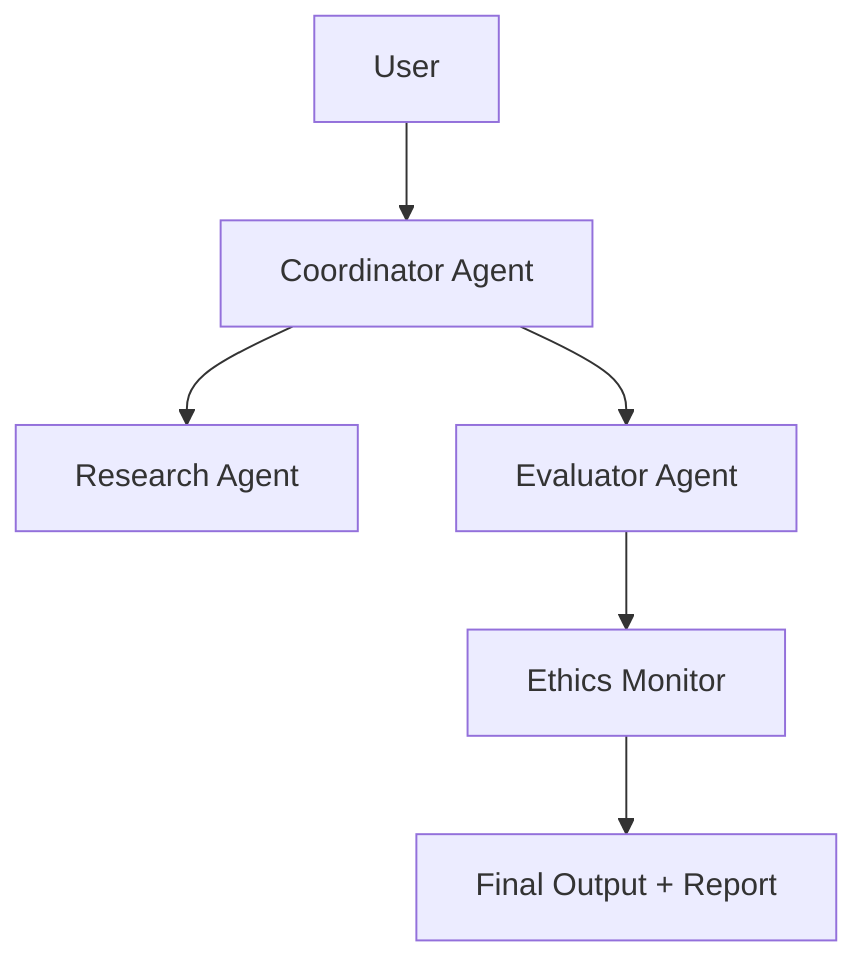

# Capstone II

# 🧩 **Capstone II: Master Engineer Challenge**

---

## **Part A – Concept Foundations**

---

### **1️⃣ Purpose of the Capstone II Challenge**

This is not a test — it’s your **AI thesis**.

Capstone II demonstrates your ability to **design, deploy, and govern an autonomous prompt system** that combines every skill you’ve mastered so far: reasoning, evaluation, data grounding, safety, collaboration, and reproducibility.

> 🧠 Analogy:
> 
> 
> In Capstone I, you built an airplane (a specialized assistant).
> 
> In Capstone II, you design the **airport** — an ecosystem where multiple AI agents communicate safely, efficiently, and ethically.
> 

✅ **Definition:**

> Master Engineer Challenge:
> 
> 
> A comprehensive multi-agent project that integrates prompting, orchestration, data pipelines, and safety frameworks to simulate enterprise-level AI product design.
> 

---

### **2️⃣ Learning Outcomes**

| **Goal** | **Outcome** |
| --- | --- |
| Integrate multiple AI agents | Agents collaborate with defined roles |
| Automate evaluation | Implement Evals / ADA metrics |
| Design orchestration logic | Apply LangChain or DSPy pipelines |
| Implement ethical governance | Embed ACHIEVE + red-teaming |
| Present reproducible results | Document system flow and metrics |

✅ The outcome: a **functional, documented, and ethically auditable AI ecosystem**.

---

### **3️⃣ Core System Architecture**

| **Layer** | **Function** | **Example Implementation** |
| --- | --- | --- |
| **Interface Layer** | Receives and routes user queries | Streamlit / Replit app |
| **Reasoning Agents** | Perform specialized sub-tasks | ResearchAgent, WriterAgent, ReviewerAgent |
| **Memory Layer** | Stores context & conversation history | LangChain Memory / VectorDB |
| **Evaluation Layer** | Scores accuracy, bias, and coherence | ADA + OpenAI Evals |
| **Governance Layer** | Ensures ethical compliance | ACHIEVE + refusal logic |
| **Documentation Layer** | Tracks workflow and results | MkDocs / GitHub Pages |

✅ This mirrors enterprise LLM orchestration systems (used in production AI).

---

### **4️⃣ Example Project Themes**

| **Theme** | **Description** | **Example Agents** |
| --- | --- | --- |
| **Research Collaboration Hub** | Multi-agent AI system for academic writing. | Researcher, Summarizer, Reviewer. |
| **CareerIQ 2.0** | AI interview panel simulation. | HR Agent, Technical Agent, Feedback Agent. |
| **Safe RAG Analyzer** | Automated bias and factual verification. | Retriever, Analyzer, Ethics Auditor. |
| **AI Business Strategist** | Generates startup ideas, validates feasibility. | Market Analyst, Risk Advisor, Strategist. |
| **EduCoach Network** | Adaptive tutor with lesson review. | Teacher, Question Generator, Evaluator. |

✅ Choose a domain aligned with your **personal brand or portfolio niche**.

---

## **Part B – Application and Build Workflow**

---

### **Step 1 – Define the System Roles and Flow**

Create a **multi-agent map** showing how roles interact:



✅ Define each agent’s **persona**, **capabilities**, and **boundaries** clearly.

---

### **Step 2 – Build the Prompt Architecture**

Each agent uses a **structured system prompt** with guardrails.

**Example:**

```markdown
System Prompt (Evaluator Agent):
You are an AI Evaluation Specialist.
Your task is to score outputs for clarity, factual accuracy, and tone.
Reject unsafe or unverifiable responses.
Always log your rationale.

```

✅ Ensure **each agent can explain its reasoning** (self-reflective prompts).

---

### **Step 3 – Add Orchestration and Memory**

Use **LangChain**, **LlamaIndex**, or **DSPy** to connect agent workflows.

**Example (LangChain Flow):**

```python
from langchain.agents import initialize_agent, Tool
from langchain import OpenAI, LLMMathChain

tools = [Tool(name="Calculator", func=LLMMathChain().run)]
llm = OpenAI(temperature=0.3)

agent = initialize_agent(tools, llm, agent_type="conversational-react-description")
agent.run("Analyze and summarize the dataset ethically.")

```

✅ Integrate memory persistence for contextual continuity (e.g., Vector DBs like Chroma or FAISS).

---

### **Step 4 – Add Evaluation Automation (ADA + Evals)**

Each agent’s outputs are automatically scored.

| **Metric** | **Evaluation Source** | **Example Script** |
| --- | --- | --- |
| Faithfulness | ADA / Evals | `assert factual_alignment > 0.9` |
| Helpfulness | User scoring + Evals | Survey prompt |
| Cost | OpenAI usage tracking | Auto-logging via API |
| Bias | Ethics Agent analysis | “Detect sentiment imbalance.” |

✅ The system continuously learns from self-evaluation logs.

---

### **Step 5 – Apply Governance & Safety Layers**

1️⃣ Embed **refusal triggers**:

```markdown
If the user asks for illegal, medical, or confidential advice, respond:
“I’m not authorized to assist with that. Would you like educational information instead?”

```

2️⃣ Add **bias and fairness audits** via an **Ethics Agent**.

3️⃣ Integrate **ACHIEVE compliance scoring** into every workflow step.

✅ Governance transforms automation into **responsible intelligence**.

---

### **Step 6 – Document and Deploy**

Prepare:

- `README.md` → System overview
- `agents/` folder → Individual role prompts
- `evals/` folder → Automated metrics
- `governance/` → Ethics, disclaimers, bias tests
- `deployment.md` → Reproducibility steps

Deploy via:

- **Replit / Streamlit (UI)**
- **GitHub Pages / MkDocs (Docs)**
- **Public demo video / report (Showcase)**

✅ Final project must include *traceable evaluation logs and an ethics statement.*

---

## **Part C – Reflection, Quiz & Master Project Evaluation**

---

### **Reflection Prompt**

> How do your agents collaborate without conflict?Which safety checks ensure your system can’t produce harm?What’s the single most valuable lesson from orchestrating multiple AI agents?
> 

---

### **Quick Quiz**

| **Q#** | **Question** | **Type** |
| --- | --- | --- |
| 1 | What is the purpose of orchestration in a multi-agent system? | Short Answer |
| 2 | Why must each agent have defined boundaries? | Short Answer |
| 3 | What framework governs ethical AI collaboration? | Short Answer |
| 4 | Which tool automates evaluation scoring? | Short Answer |
| 5 | What ensures reproducibility in AI projects? | Short Answer |

---

### **Answer Key (Rebux Format)**

| **Q#** | **Answer** | **Explanation (Rebux)** |
| --- | --- | --- |
| 1 | Coordinate agent roles and task delegation. | Prevents overlap and enhances scalability. |
| 2 | Avoids instruction conflict and scope creep. | Each agent remains reliable. |
| 3 | ACHIEVE Framework. | Standard for ethical prompt systems. |
| 4 | ADA / OpenAI Evals. | Automates bias and accuracy measurement. |
| 5 | Documentation + version control. | Enables transparent replication. |

---

### **Master Project – “Multi-Agent AI Ecosystem”**

> Goal: Build and document a real AI system with 3+ collaborating agents.
> 

| **Step** | **Instruction** | **Example** |
| --- | --- | --- |
| 1️⃣ | Choose your ecosystem goal. | “Build AI Research Assistant Network.” |
| 2️⃣ | Define 3 agents with unique prompts. | Research, Reviewer, Ethics. |
| 3️⃣ | Connect via LangChain or DSPy pipeline. | Define orchestration order. |
| 4️⃣ | Add automated Evals + ACHIEVE audit. | Bias & accuracy metrics. |
| 5️⃣ | Publish final docs + demo. | Include live deployment + GitHub repo. |

✅ *Advanced Option:*

Add self-healing logic — where one agent critiques another and triggers auto-repair cycles (Critic–Helper pattern).

---

### **Instructor Rubric (Optional)**

| **Criterion** | **Score (1–10)** | **Focus Area** |
| --- | --- | --- |
| System Design |  | Logical structure and agent independence |
| Technical Execution |  | Proper orchestration and automation |
| Ethical Governance |  | ACHIEVE compliance and red-teaming |
| Evaluation & Reporting |  | Use of Evals and ADA metrics |
| Documentation & Demo |  | Transparency, usability, public-ready |

---

✅ **Summary Insight**

> The Master Engineer Challenge is more than a capstone — it’s a manifesto of responsible intelligence.
> 
> 
> You’ve now proven not just technical ability, but the moral discipline to engineer systems that *think, reason, and care.*
> 

💡 **Prompt Engineering Principle:**

> “True mastery lies not in controlling intelligence — but in aligning it with human values.”
>